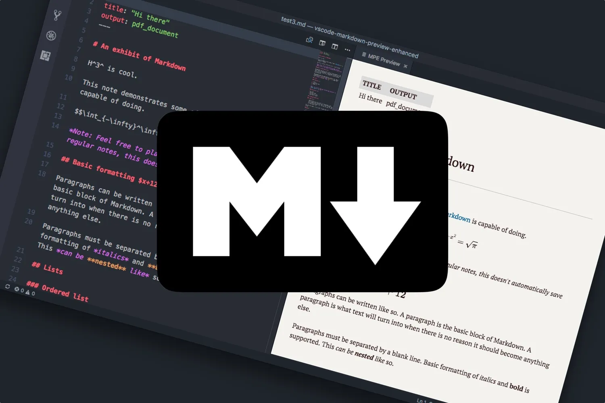

# Markdown

One Template to rule them all

<small>A template for all your markdown needs. Creating beautiful documents and slides by only using markdown.</small>

<!--
_backgroundImage: url('assets/3x4/darker/blue-hex-0.png')
_paginate: false
_transition: fade-out
 -->

---



# Introduction

A template for all your markdown needs. Creating beautiful documents and slides by only using markdown.

<!--
_backgroundImage: url('assets/3x4/darker/blue-hex-outline-2.png')
_header: Introduction
 -->

---


# Features

- Beautiful title page
- Automatic table of contents
- Bibliography support
- Full markdown support
- Easy to use
- Easy to extend

<!--
_backgroundImage: url('assets/3x4/darker/blue-hex-outline-3.png')
_header: Features
 -->

---

## <span class="morph" style="--morph-name:a1;">Writing your document</span>

Write your document in the `main.md` file. This file is the main file of your document and will be compiled to the final document using the Makefile. You can use all features of markdown in this file. For a detailed description of the markdown syntax see the [markdown guide](https://www.markdownguide.org/basic-syntax/)

<!--
_backgroundImage: url('assets/3x4/darker/violet-wave-4.png')
_header: Writing
_footer: https://www.markdownguide.org/basic-syntax/
 -->

---

## <span class="morph" style="--morph-name:a1;">Writing your document</span>

In addition to the markdown syntax you can also use LaTeX commands in your document. This is useful if you want to use some advanced features of LaTeX. For example you can use the `\newpage` command to start a new page or the `\cite` command to cite a source. For a detailed description of the LaTeX syntax see the [LaTeX Wikibook](https://en.wikibooks.org/wiki/LaTeX)

<!--
_backgroundImage: url('assets/3x4/darker/purple-wave-5.png')
_header: Writing
_footer: https://en.wikibooks.org/wiki/LaTeX
 -->

---

# Installation

You can work on this template with any text editor you like. But you need to have some requirements installed on your system in order to compile the document. To install the requirements on your system you can use the Makefile. It will install all required dependencies for you automatically.

```bash
make install
```

<!--
Requirements:
- make
- pandoc
- texlive-core or Miktex
- nodejs
- texteditor like vscode
 -->

<!--
_backgroundImage: url('assets/3x4/darker/emerald-blob-6.png')
_header: Installation
_transition: fade-out
 -->

---

# Compiling

To compile the document just use the Makefile.

```bash
make			# Renders the main.md and slides.md files to various formats. (Default)
make document		# Renders the main.md file to a PDF document.
make slides		# Renders the slides.md file to a PDF, HTML and PPTX file.
make clear		# Deletes all temporary files
make purge		# Deletes all temporary and output files
make setup		# Installs the template and all dependencies
make help		# Shows this help
```

<!--
make setup		# Installs the template and all dependencies.
make tex		# Renders the main.md file to a LaTeX document.
make slides		# Renders the slides.md file to a PDF, HTML and PPTX file.
make present	# Starts a live preview of the slides.md file in your browser.
make clear		# Deletes all temporary files.
 -->

<!--
_backgroundImage: url('assets/3x4/darker/teal-blob-7.png')
_header: Compiling
 -->

---

# <!-- fit --> Have fun writing! :rocket: :100: :tada:

<!--
_backgroundImage: url('assets/3x4/darker/fuchsia-poly-outline-8.png')
_paginate: false
 -->
